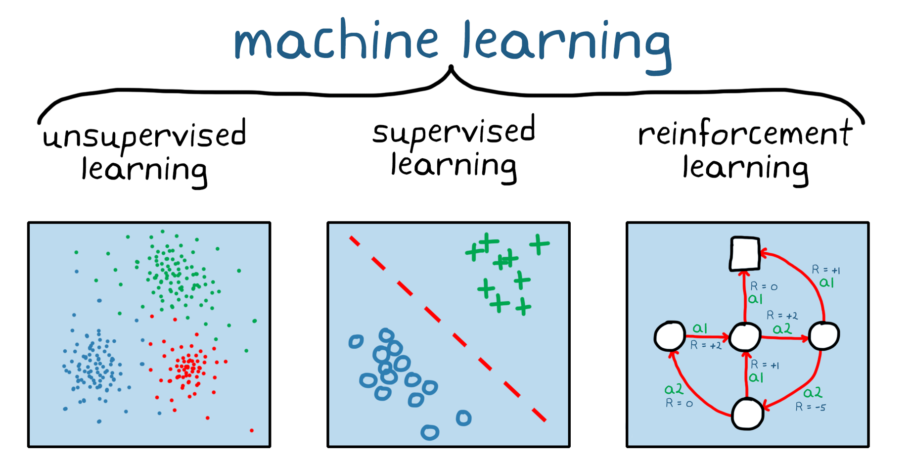

# **1.4 Game - Connecting the Dots**

## Integrating the Map and TicTacToe Sections

The "Connecting the Dots" section of the assignment serves as a bridge between the "Map" section and the "TicTacToe" section. It involves guiding our protagonist, Suzume, from the starting point at the top left of the map to the destination using the shortest path that passes through exactly four stations on the map. To accomplish this, we leverage the methods and classes we previously defined in the `BasicFeature` module, including reading the image into a `PixelMap` and utilizing the shortest path-finding algorithm.

As Suzume progresses through the map, she encounters stations where she is required to play a game of TicTacToe. The game can be played against an engine, computer, or even an AI system, which is a popular concept associated with the emergence of technologies like `ChatGPT` (Chat Generative Pre-trained Transformer).

However, it's important to note that our engine or AI system doesn't incorporate the complex training processes typically associated with modern AI techniques such as **Reinforcement Learning**. Instead, we have defined a set of rules for the engine, enabling it to assess the current state of the game board and respond strategically to either win or intentionally lose based on the chosen difficulty level and board configuration. Further details regarding the engine's functionality have been discussed in the relevant sections.

This article aims to provide an overview of how the classes within the `com.assignment.suzume.game` module are interconnected and integrated to ensure the smooth and successful execution of the game.
