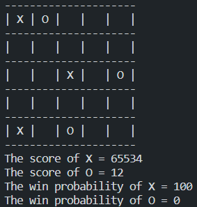
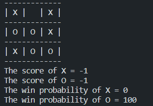
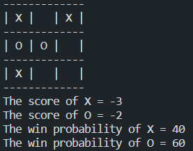
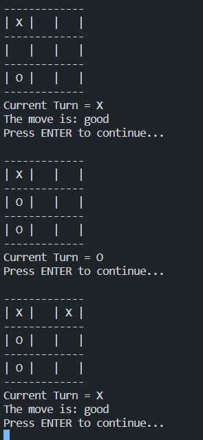
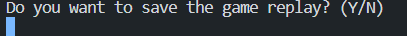
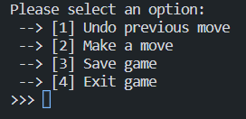

# **3.3 Auxiliary Tools**

## Game Analyzer

The Game Analyzer is responsible for analyzing the win rate of both players in a game based on their move probabilities. Its core algorithm consists of two key methods: `.get3X3Score()` and `getWinProbability()`. These methods form the foundation for the Game Analyzer, and understanding them is crucial to comprehending how the entire method operates.

Let's dive into the source code. Taking a deep dive into the source code is the epitome of a mature and professional programmer's approach. **Instead of merely being an API engineer who mindlessly calls APIs, truly understanding the inner workings of the code is essential.**

### `.getLineScore()`

Before delving into the intricacies of `.get3X3Score()`, let's begin by examining a smaller yet vital piece of the puzzle.

```java
protected int getLineScore(char mark, char[] line) {
    int score = 0;
    for (char point : line) {
        if (point == mark)
            score++;
        else if (point != ' ')
            return 0;
    }
    return score;
}
```

To grasp the essence of this code, let's consider a TicTacToe board arrangement:

```bash
 --- --- ---
| X |   |   |
 --- --- ---
|   |   |   |
 --- --- ---
|   |   |   |
 --- --- ---
```

Imagine that an 'X' mark is placed in the top-left position. In this configuration, the 'X' mark has the potential to form three winning moves:

```bash
 --- --- ---        --- --- ---        --- --- ---
| X |   |   |      | X | X | X |      | X |   |   |
 --- --- ---        --- --- ---        --- --- ---
| X |   |   |      |   |   |   |      |   | X |   |
 --- --- ---        --- --- ---        --- --- ---
| X |   |   |      |   |   |   |      |   |   | X |
 --- --- ---        --- --- ---        --- --- ---
```

As long as the 'X' mark on each line hasn't been blocked by the opponent, the line's score will increment by 1. For instance:

```bash
 --- --- ---
| X | X |   |
 --- --- ---
|   | X |   |
 --- --- ---
|   |   | X |
 --- --- ---
```

In this scenario,

- The horizontal line on the first row (row = 0) has a score of 2
- The diagonal line has a score of 3
- The vertical line on the first column (column = 0) has a score of 1.

Although the score doesn't hold significant meaning at this stage, it becomes a potent evaluation tool in the subsequent `.get3X3Score()` method. For now, let's consider that if `.getLineScore()` returns a value greater than 0, it indicates that the mark on the respective line has a chance to form a complete line.

In other words, `.getLineScore()` simply answers the question, _"Does the mark have the potential to win on this line?"_ If the line is blocked by the opponent's mark, then there is no way for the mark to achieve victory.

### `.get3X3Score()`

Now, let's dive into the code of the `.get3X3Score()` method:

```java
protected int[] get3X3Score(char mark, int topLeftRow, int topLeftCol) {
    int totalScore = 0, score = 0;
    int winMove = 0;

    // Check the rows
    for (int row = 0; row < 3; row++) {
        score = getLineScore(mark, new char[] {
            // Some implementation details
        });
        winMove += score >= 2 ? 1 : 0;
        totalScore += score > 0 ? 1 : 0;
    }

    // Checks the cols
    for (int col = 0; col < 3; col++) {
        score = getLineScore(mark, new char[] {
            // Some implementation details
        });
        winMove += score >= 2 ? 1 : 0;
        totalScore += score > 0 ? 1 : 0;
    }

    // Check the diagonals
    score = getLineScore(mark, new char[] {
            // Some implementation details
    });
    winMove += score >= 2 ? 1 : 0;
    totalScore += score > 0 ? 1 : 0;

    // Check the diagonals
    score = getLineScore(mark, new char[] {
            // Some implementation details
    });
    winMove += score >= 2 ? 1 : 0;
    totalScore += score > 0 ? 1 : 0;

    return new int[] { totalScore, winMove };
}
```

As usual, we've hidden some implementation details to focus on the high-level design. However, if we observe closely, we can identify an underlying pattern in the code:

```java
score = getLineScore(
    // Some implementation details
);
winMove += score >= 2 ? 1 : 0;
totalScore += score > 0 ? 1 : 0;
```

Understanding this code snippet is key to comprehending how the `GameAnalyzer` operates. As we mentioned earlier, the value of `score` doesn't matter much to `totalScore` because it simply represents the probability of winning. Regardless of the actual score obtained, as long as it is not blocked, it will be treated as 1 when added to `totalScore`, as indicated by `totalScore += score > 0 ? 1 : 0`.

However, the score can have a significant impact on `winMove`. What exactly is a `winMove`? A `winMove` refers to a line on a 3x3 board that has two marks which haven't been blocked yet. Here are some examples of `winMove`:

```bash
 --- --- ---        --- --- ---        --- --- ---
| X |   |   |      | X |   | X |      |   |   |   |
 --- --- ---        --- --- ---        --- --- ---
| X |   |   |      |   |   |   |      |   | X |   |
 --- --- ---        --- --- ---        --- --- ---
|   |   |   |      |   |   |   |      |   |   | X |
 --- --- ---        --- --- ---        --- --- ---
```

A `winMove` indicates how many winning moves a player can potentially make. In a standard TicTacToe game, if a player has two or more `winMove`s available, we can confidently say that the player is guaranteed to win the game as long as they choose their moves optimally.

Moving on, the `.get3X3Score()` method examines every line, checks their respective `winMove` and `score`, and accumulates them to return an integer array consisting of the mentioned values.

### `.getWinProbability()`

The algorithm behind the `.getWinProbability()` method is quite sophisticated, as it leverages mathematical concepts for generalization and abstraction purposes. Let's delve into the source code:

```java
public double[] getWinProbability() {
    int[] playerOneScore = getScore(playerOne);
        int[] playerTwoScore = getScore(playerTwo);
        int totalScore = Math.abs(playerOneScore[0] + playerTwoScore[0]);

        if (totalScore == 0) return new double[] { 0.5, 0.5 };
        if (totalScore == playerOneScore[0]) return new double[] { 1, 0 };
        if (totalScore == playerTwoScore[0]) return new double[] { 0, 1 };

        int playerOneWinMove = playerOneScore[1];
        int playerTwoWinMove = playerTwoScore[1];

        if(isPlayerOneTurn && playerOneWinMove >= 1) return new double[] { 1, 0 };
        if(isPlayerOneTurn && playerTwoWinMove >= 2) return new double[] { 0, 1 };
        if(!isPlayerOneTurn && playerTwoWinMove >= 1) return new double[] { 0, 1 };
        if(!isPlayerOneTurn && playerOneWinMove >= 2) return new double[] { 1, 0 };

        double playerOneWinProbability = (totalScore + playerOneScore[0]) % totalScore / (double) totalScore;
        double playerTwoWinProbability = (totalScore + playerTwoScore[0]) % totalScore / (double) totalScore;

        return new double[] { playerOneWinProbability, playerTwoWinProbability };
}
```

By invoking the abstract method `.getScore()`, we can obtain the score of each respective player. However, it's important to note that the score value can be negative. In the case of `ReverseGamingBoard`, the winning criterion is to be the slower player who makes a line on the board. Hence, negative values are employed. In this scenario, the `playerWinProbability` is calculated using the following formula:

$$\left(totalScore + playerScore \right) \bmod totalScore \div totalScore$$

Now, let's explore a couple of examples:

**Example 1:**

$$
\text{{score}} = \frac{{(totalScore + playerScore) \mod \\totalScore}}{{totalScore}}
= \frac{{(10 + 4) \mod 10}}{{10}}
= \frac{{14 \mod 10}}{{10}}
= \frac{{4}}{{10}}
= 0.4
$$

**Example 2:**

$$
\text{{score}} = \frac{{(totalScore + playerScore) \mod totalScore}}{{totalScore}} = \frac{{(10 + 6) \mod 10}}{{10}} = \frac{{16 \mod 10}}{{10}} = \frac{{6}}{{10}} = 0.6
$$

By using the substitution method, we can demonstrate that the mathematical formula successfully generalizes the pattern and can be applied to calculate the score portion obtained by a player.

However, it is imperative to handle potential edge cases, and fortunately, the previous code snippet offers a reliable solution. It addresses scenarios that may pose challenges to the mathematical formula, such as the "ArithmeticException: Division by zero" and the "0 - 0" win rate. Let's take a closer look at the snippet:

```java
if (totalScore == 0)
    return new double[] { 0.5, 0.5 };
if (totalScore == playerOneScore[0])
    return new double[] { 1, 0 };
if (totalScore == playerTwoScore[0])
    return new double[] { 0, 1 };
```

In addition to these edge cases, where the mathematical formula encounters limitations, we should consider scenarios where we can determine the winner in advance, even before any player has made a move. Allow me to present a captivating example:

```bash
 --- --- ---
| X | O | O |
 --- --- ---
|   |   | O |
 --- --- ---
| X |   | X |
 --- --- ---
```

Suppose it is now `X`'s turn. In this scenario, we can confidently declare `X` as the eventual victor, as they have multiple optimal moves that lead to victory:

```bash
 --- --- ---        --- --- ---        --- --- ---
| X | O | O |      | X | O | O |      | X | O | O |
 --- --- ---        --- --- ---        --- --- ---
| X |   | O |      |   |   | O |      |   | X | O |
 --- --- ---        --- --- ---        --- --- ---
| X |   | X |      | X | X | X |      | X |   | X |
 --- --- ---        --- --- ---        --- --- ---
```

Hence, when it is `X`'s turn, as long as they have at least one winning move available, their win rate stands at an unwavering 100%. However, what if it is not `X`'s turn? In that case, we need to assess whether `O` has at least one winning move. If so, assuming that `O` plays intelligently, they will emerge victorious. Conversely, if `O` does not possess a winning move, as long as `X` has at least two winning moves, they can secure a win. Allow me to illustrate this situation:

```bash
 --- --- ---
| X | O |   |
 --- --- ---
|   |   | O |
 --- --- ---
| X |   | X |
 --- --- ---
```

Regardless of `O`'s choice, `X` is guaranteed to triumph as long as they make wise and optimal moves.

By considering these edge cases and employing both strategic thinking and a touch of humor, we can ensure a robust and engaging gaming experience.

Now, let's dive deeper into the implementation of the `.getScore()` method in the child classes.

### Exploring `.getScore()` in VariantAnalyzer

Let's dive into the `.getScore()` method of the `VariantAnalyzer` class, which happens to be the most straightforward and easiest to comprehend. The source code for this method is as follows:

```java
@Override
public int[] getScore(char mark) {
    int[] scores = get3X3Score(mark, 0, 0);
    int totalScore = scores[0];
    int winMove = scores[1];
    return new int[] {
        winMove >= 2 ? winMove * WIN_SCORE : totalScore, winMove };
}
```

Within this code snippet, we can observe that if a player possesses two or more `winMove` instances, their chances of winning are significantly high. This is where the `private static final int WIN_SCORE = Integer.MAX_VALUE >> 16` variable comes into play. You might wonder, why is `Integer.MAX_VALUE` equal to $2^{31} - 1$ instead of $2^{31}$? The answer lies in the fact that Java supports a maximum signed integer value of `0x7fffffff`, which equates to $2^{31}-1$. On the other hand, $2^{31}$, represented as `0x80000000`, is negative. Thus, the positive range is limited to $2^{31}-1$.

Now, let's understand the calculation of `WIN_SCORE`. By shifting the bits 16 times to the left (equivalent to dividing the value by $2^{16}$ or 65536), we can express it as:

$$\frac{2147483648}{65536} = 32678$$

Or, in a more playful manner:

$$2^{31} - 1 \div 2^{16} = 2^{31-16} - 2^{-16} = 2^{15} - 2^{-16}= 32677.99999 \approx 32677$$

Comparing this value with the possible range of `totalScore` in a 3X3 board, which can only reach a maximum of 9, we can see that `WIN_SCORE` is relatively large enough to diminish the impact of `totalScore` in the final calculation. However, if the opponent possesses two or more winning moves, then their portion of the score will be determined by the number of winning moves they hold. Let's take a look at an example scenario:

```java
public static void main(String[] args) {
    VariantBoard gamingBoard = new VariantBoard();
    // Code omitted
    gamingBoard.printBoard();
    VariantGameAnalyzer variantGameAnalyzer = new VariantGameAnalyzer('X', 'O', gamingBoard);
    System.out.println("The score of X = " + variantGameAnalyzer.getScore('X')[0]);
    System.out.println("The score of O = " + variantGameAnalyzer.getScore('O')[0]);
}
```

This is the resulting board placement:

```bash
-------------
| X |   | X |
-------------
| O |   |   |
-------------
| X | O |   |
-------------
```

Now, what are the values for `X`? As calculated earlier, it is 65534, which is obtained by multiplying the `winMove` value by `WIN_SCORE`: $2 \times 32677 = 65534$.

```java
The score of X = 65534
The score of O = 2
```

If we include the following lines for testing purposes:

```java
double[] winProbability = variantGameAnalyzer.getWinProbability();
System.out.println("The win probability of X = " + (int) (winProbability[0] * 100));
System.out.println("The win probability of O = " + (

int) (winProbability[1] * 100));
```

We'll receive the following results:

```bash
The win probability of X = 100
The win probability of O = 0
```

In this case, the win probability of `X` is 99% while `O` has a win probability of 0%.

Through this examination of the `.getScore()` method, we have gained insights into how the scoring mechanism works in the `VariantAnalyzer` class. This information contributes to a better understanding of the underlying game dynamics and the evaluation of players' moves.

### The `.getScore()` Method in RegularGame

Now, let's dive into the `.getScore()` method of the `RegularGame` class, which shares similarities with the one in `VariantGame`. The underlying algorithm revolves around dividing the 5x5 gaming board into nine 3x3 boards and evaluating each of them.

Imagine the complete 5x5 board displayed as follows:

```bash
+-----+-----+-----+-----+-----+
|  1  |  2  |  3  |  4  |  5  |
+-----+-----+-----+-----+-----+
|  6  |  7  |  8  |  9  |  10 |
+-----+-----+-----+-----+-----+
|  11 |  12 |  13 |  14 |  15 |
+-----+-----+-----+-----+-----+
|  16 |  17 |  18 |  19 |  20 |
+-----+-----+-----+-----+-----+
|  21 |  22 |  23 |  24 |  25 |
+-----+-----+-----+-----+-----+
```

By dividing it into 3x3 sections, the layout would appear as follows:

```bash
+-----+-----+-----+  +-----+-----+-----+  +-----+-----+-----+
|  1  |  2  |  3  |  |  2  |  3  |  4  |  |  3  |  4  |  5  |
+-----+-----+-----+  +-----+-----+-----+  +-----+-----+-----+
|  6  |  7  |  8  |  |  7  |  8  |  9  |  |  8  |  9  |  10  |
+-----+-----+-----+  +-----+-----+-----+  +-----+-----+-----+
|  11 |  12 |  13 |  |  12 |  13 |  14 |  |  13 |  14 |  15 |
+-----+-----+-----+  +-----+-----+-----+  +-----+-----+-----+
```

For each 3x3 board, the `.getScore()` method from the `VariantAnalyzer` is applied. Here's an example code snippet:

```java
public static void main(String[] args) {
    RegularBoard board = new RegularBoard();
    RegularGameAnalyzer regularGameAnalyzer = new RegularGameAnalyzer('X', 'O', board);

    // Board initialization
    board.placeMark(0, 0, 'X');
    board.placeMark(2, 2, 'X');
    board.placeMark(4, 0, 'X');
    board.placeMark(0, 1, 'O');
    board.placeMark(2, 4, 'O');
    board.placeMark(4, 2, 'O');

    board.printBoard();
    regularGameAnalyzer.setPlayerTurn(true);

    System.out.println("The score of X = " + regularGameAnalyzer.getScore('X')[0]);
    System.out.println("The score of O = " + regularGameAnalyzer.getScore('O')[0]);

    double[] winProbability = regularGameAnalyzer.getWinProbability();
    System.out.println("The win probability of X = " + (int) (winProbability[0] * 100));
    System.out.println("The win probability of O = " + (int) (winProbability[1] * 100));
}
```

The resulting output would be:

```bash
---------------------
| X | O |   |   |   |
---------------------
|   |   |   |   |   |
---------------------
|   |   | X |   | O |
---------------------
|   |   |   |   |   |
---------------------
| X |   | O |   |   |
---------------------
The score of X = 65534
The score of O = 12
The win probability of X = 100
The win probability of O = 0
```

Here, the score for player X is 65534, while the score for player O is 12. The win probability for player X is 100%, indicating a high chance of winning, whereas the win probability for player O is 0%, indicating no winning possibility.

### The `.getScore()` Method in ReverseAnalyzer

Now, let's take a closer look at the `.getScore()` method in the `ReverseAnalyzer` class. This method shares similarities with the `VariantGameAnalyzer`, but with one notable difference: the final output is transformed into a negative value. This approach is achieved using the bitwise complement operator `~` and adding 1 to the result. Why is this done? Well, the use of bitwise operations, such as two's complement, is significantly faster than multiplication.

Here's the code snippet for the `.getScore()` method in `ReverseAnalyzer`:

```java
@Override
public int[] getScore(char mark) {
    int[] scores = get3X3Score(mark, 0, 0);
    int totalScore = scores[0];
    int winMove = scores[1];
    return new int[] { ~totalScore + 1, winMove };
}
```

Let's examine this code and observe its output:

```java
public static void main(String[] args) {
    ReverseBoard board = new ReverseBoard();
    ReverseGameAnalyzer reverseGameAnalyzer = new ReverseGameAnalyzer('X', 'O', board);

    // Board initialization
    board.placeMark(0, 0, 'X');
    board.placeMark(0, 2, 'X');
    board.placeMark(2, 0, 'X');
    board.placeMark(1, 0, 'O');
    board.placeMark(1, 1, 'O');
    board.placeMark(1, 2, 'X');
    board.placeMark(2, 1, 'O');
    board.placeMark(2, 2, 'O');

    board.printBoard();
    reverseGameAnalyzer.setPlayerTurn(true);

    System.out.println("The score of X = " + reverseGameAnalyzer.getScore('X')[0]);
    System.out.println("The score of O = " + reverseGameAnalyzer.getScore('O')[0]);

    double[] winProbability = reverseGameAnalyzer.getWinProbability();
    System.out.println("The win probability of X = " + (int) (winProbability[0] * 100));
    System.out.println("The win probability of O = " + (int) (winProbability[1] * 100));
}
```

The resulting output is as follows:

```bash
-------------
| X |   | X |
-------------
| O | O | X |
-------------
| X | O | O |
-------------
The score of X = -1
The score of O = -1
The win probability of X = 0
The win probability of O = 100
```

Here, we see that the score for player X is -1, while the score for player O is -1. The win probability for player X is 0%, indicating no chance of winning, while the win probability for player O is 100%, indicating a high likelihood of winning.

If you carefully analyze the code, you will notice that the `.getWinProbability()` method has been overridden, indicating that its internal logic differs from the one declared in the parent class, `GameAnalyzer`. Let's take a closer look at the code snippet:

```java
@Override
public double[] getWinProbability() {
    int[] playerOneScore = getScore(playerOne);
    int[] playerTwoScore = getScore(playerTwo);
    int totalScore = Math.abs(playerOneScore[0] + playerTwoScore[0]);

    if (totalScore == 0)
        return new double[] { 0.5, 0.5 };
    if (totalScore == Math.abs(playerOneScore[0]))
        return new double[] { 0, 1 };
    if (totalScore == Math.abs(playerTwoScore[0]))
        return new double[] { 1, 0 };

    if (isBoardAlmostFull()) {
        if(isPlayerOneTurn && playerOneScore[1] > 0)
            return new double[] { 0, 1 };
        if(!isPlayerOneTurn && playerTwoScore[1] > 0)
            return new double[] { 1, 0 };
    }

    double playerOneWinProbability = (totalScore + playerOneScore[0]) % totalScore / (double) totalScore;
    double playerTwoWinProbability = (totalScore + playerTwoScore[0]) % totalScore / (double) totalScore;

    return new double[] { playerOneWinProbability, playerTwoWinProbability };
}
```

In reality, the intricate logic used to determine the winner in advance has been eliminated from the code. This decision was made due to the inherent challenge of accurately predicting the winner before the final moment. However, there is still a way to determine the winner when the `isBoardAlmostFull` condition is met. Let's take a closer look at the source code:

```java
private boolean isBoardAlmostFull() {
    int count = 0;
    for(int i = 0; i < 3; i++)
        for(int j = 0; j < 3; j++)
            if(gamingBoard.getBoard()[i][j] != ' ')
                count++;
    return count >= 8;
}
```

This piece of code employs a straightforward approach known as brute force. It iterates over the gaming board's cells and increments a counter whenever a cell contains a mark other than an empty space. Once the count reaches eight or more, the board is considered to be _almost full_.

By implementing this method, the program can identify when the gameplay has reached a critical point where only a few empty spaces remain on the board. This information becomes valuable as it indicates that the game is nearing its conclusion, making it easier to determine the winner based on the remaining moves.

So, while the code no longer attempts to predict the winner in advance, the `isBoardAlmostFull` function offers a practical means of assessing the state of the game and providing insights into the potential outcome. It's a helpful tool for players and strategists alike to gauge the progress and make informed decisions as they approach the thrilling conclusion of the game.

Let's take a look on the following example to fully comprehend the concept:

```java
public static void main(String[] args) {
    ReverseBoard board = new ReverseBoard();
    ReverseGameAnalyzer reverseGameAnalyzer = new ReverseGameAnalyzer('X', 'O', board);

    board.placeMark(0, 0, 'X');
    board.placeMark(0, 2, 'X');
    board.placeMark(2, 0, 'X');
    board.placeMark(1, 0, 'O');
    board.placeMark(1, 1, 'O');
    // board.placeMark(1, 2, 'X');
    // board.placeMark(2, 1, 'O');
    // board.placeMark(2, 2, 'O');

    board.printBoard();
    reverseGameAnalyzer.setPlayerTurn(true);

    System.out.println("The score of X = " + reverseGameAnalyzer.getScore('X')[0]);
    System.out.println("The score of O = " + reverseGameAnalyzer.getScore('O')[0]);

    double[] winProbability = reverseGameAnalyzer.getWinProbability();
    System.out.println("The win probability of X = " + (int) (winProbability[0] * 100));
    System.out.println("The win probability of O = " + (int) (winProbability[1] * 100));
}
```

The output will be shown as below:

```bash
-------------
| X |   | X |
-------------
| O | O |   |
-------------
| X |   |   |
-------------
The score of X = -3
The score of O = -2
The win probability of X = 40
The win probability of O = 60
```

"If you require the sample output screenshot, here it is:

<div style="display: flex; justify-content: center;">
    <div style="margin-right: 10px;">
        
        <br>
        <em>RegularGameAnalyzer</em>
    </div>
    <div style="margin-right: 10px;">
        
        <br>
        <em>ReverseGameAnalyzer - 1</em>
    </div>
    <div>
        
        <br>
        <em>ReverseGameAnalyzer - 2</em>
    </div>
</div>

## VideoPlayer

Imagine each game replay being stored on a CD (compact disc) that we want to play. Just like in reality, we need a CD player to play the CD and review its contents, right? The same concept applies here with the `VideoPlayer` class, as the name itself suggests.

Let's explore the inner workings of the `VideoPlayer` blackbox:

```java
public VideoPlayer(GamingBoard board, GameAnalyzer analyzer) {
    this.board = board;
    this.analyzer = analyzer;
    this.sequentialMoveHistory = new Stack<>();
    this.moveEvaluation = new Stack<>();
    initializeVideoPlayer();
}

private void initializeVideoPlayer() {
    Stack<int[]> reverseMoveHistory = board.getMoveHistory();
    moveEvaluation.push(analyzer.getWinProbability());

    while (!reverseMoveHistory.isEmpty()) {
        int[] move = reverseMoveHistory.pop();
        sequentialMoveHistory.push(move);
        board.removeMark(move[0], move[1]);
        moveEvaluation.push(analyzer.getWinProbability());
    }
}
```

In a typical video player, the video is played frame by frame. Similarly, in the TicTacToe game's `VideoPlayer`, the moves are played step by step. However, the steps are stored in a stack called `reverseMoveHistory`, indicating that the steps are stored in reverse order. To reverse this stack-based approach, a new `Stack` is created, and the elements are popped from the old stack and pushed into the new one.

```java
while (!reverseMoveHistory.isEmpty()) {
    int[] move = reverseMoveHistory.pop();
    sequentialMoveHistory.push(move);
    // Code omitted
}
```

However, as per the requirements of the question, we need to incorporate an evaluation system that categorizes moves as either "good" or "bad."

To fulfill this requirement, an evaluation system has been implemented as shown in the following code snippet:

```java
public void replay() {
    while (!sequentialMoveHistory.isEmpty()) {
        // Code omitted
        double[] previousEvaluation = moveEvaluation.pop();
        double[] currentEvaluation = moveEvaluation.peek();

        if ((char) move[2] == 'X') {
            double winProbabilityChange = currentEvaluation[0] - previousEvaluation[0];
            System.out.println(
                    "The move is: " + (winProbabilityChange > 0 ? "good" : "bad"));
            // Code omitted
        }
    }
}
```

To maintain simplicity and clarity, some unnecessary code has been omitted, allowing us to focus on the core idea. The evaluation system revolves around the `moveEvaluation` stack, which was introduced earlier and is implemented using the `GameAnalyzer` class. It calculates the probability change between moves. If the change is positive, the move is categorized as **"good"**; otherwise, it is classified as **"bad"**.

Here's a screenshot of the output:

<p align="center">
    
    <br />
    <em>Output of the VideoPlayer</em>
</p>

## UserActionHandler

The `UserActionHandler` class is responsible for displaying the option menu and handling the player's choices. Let's explore an example code snippet and its corresponding output:

### Initialization

```java
UserActionHandler handler = new UserActionHandler(1, new VariantBoard(), null);
```

### Show save replay menu

```java
handler.showSaveReplayMenu();
```

<p align="center">
    
    <br />
    <em>Output of the `.showSaveReplayMenu()`</em>
</p>

### Show user menu

```java
handler.showUserMenu(new Gamer("Suzume", 'X'));
```

<p align="center">
    
    <br />
    <em>Output of the `.showUserMenu()`</em>
</p>

Now, let's delve into how the `UserActionHandler` handles each event:

```java
private void saveGameReplay() {
    gameFileManager.saveGameReplay(board);
    System.out.println("Game replay saved successfully!");
}

private void handleUndoMove() {
    if (board.takeBackMove()) {
        System.out.println("Move undone successfully!");
    } else {
        System.out.println("No move to undo!");
    }
}

private void saveGame() {
    gameFileManager.saveGame(runner, gameMode);
    System.out.println("Game saved successfully!");
}
```

As some of the core methods call other relevant classes, such as `GameDataFileManager` and `GamingBoard`, we will discuss those modules separately.
