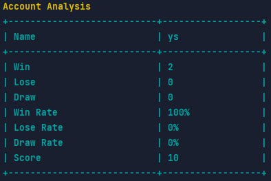
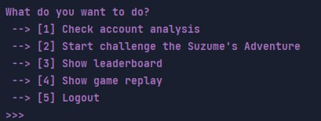

# **4 Profile **

## Profile Package Structure

The code is organized into the package `com.assignment.suzume.profile`, which contains the classes related to the user profile.

### 1. **`Dashboard`** (Class)

The `Dashboard` class is responsible for displaying the user's profile and providing options for different actions within the application. It has the following methods:

- `checkAccountAnalysis()`: This method displays the account analysis information such as the user's name, number of wins, losses, draws, win rate, lose rate, draw rate, and score.

- `showDashboard()`: This method is the main entry point for the user's profile dashboard. It presents a menu of options and executes the corresponding actions based on the user's choice.
  This is the code:

```java
 public void showDashboard() {
    System.out.println("Welcome back, " + user.getName());

    loop: while (true) {
            System.out.println();
            System.out.println("What do you want to do?");
            System.out.println(" --> [1] Check account analysis");
            System.out.println(" --> [2] Start challenge the Suzume's Adventure");
            System.out.println(" --> [3] Show leaderboard");
            System.out.println(" --> [4] Show game replay");
            System.out.println(" --> [5] Logout");

            ConsolePrinter.printDecorator();


            int choice = InputHandler.getIntInput();

            // Omitted code...
    }
 }
```

### 2. **`User`** (Class)

The `User` class represents a user profile and contains information such as the user's name, number of wins, losses, draws, and score. It has the following methods:

- `getInstance()`: This method returns the singleton instance of the `User` class, ensuring that only one instance exists throughout the application.

- `initializeProfile()`: This method is used to initialize the user's profile with the provided data such as name, wins, losses, draws, and score.

- `updateResult()`: This method updates the user's profile based on the game result. It takes a parameter `result`, which represents the outcome of the game (positive for a win, negative for a loss, and 0 for a draw).

- Various getter methods: These methods are used to retrieve the user's profile information such as the number of wins, losses, draws, score, and name.

Output:



## Usage

The code demonstrates the usage of the `Dashboard` and `User` classes. In the `showDashboard()` method, a menu is displayed using `System.out.println()` statements, and the user's choice is obtained using `InputHandler.getIntInput()`. Based on the user's choice, different actions are performed:

Case 1: Calls the `checkAccountAnalysis()` method to display the account analysis information.

Case 2: Starts a game by creating a new instance of the `ConsoleGame` class and invoking its `play()` method.

Case 3: Shows the database by calling the `showDatabase()` method on the `DatabaseManager` class.

Case 4: Loads a game replay using `GameFileDataManager` and plays it using a `VideoPlayer`.

Case 5: Logs out the user and breaks the loop to exit the dashboard.

Output:



Overall, the code provides a simple user profile dashboard for a game application, allowing users to view their account analysis, play games, view the leaderboard, watch game replays, and logout.
