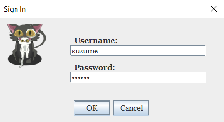
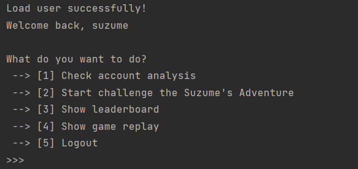
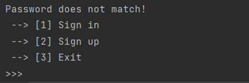
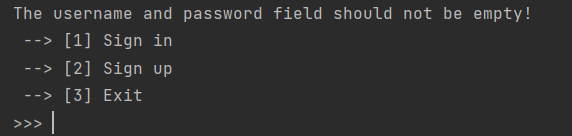
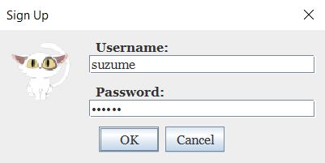
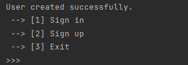
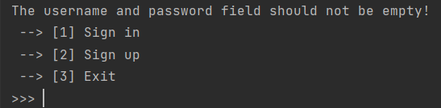

# **5 Authentication**

The Authentication package consists of classes and utilities responsible for managing user authentication processes within the application. It provides functionality for user login and sign-up operations, ensuring secure access to the system. The package contains three main classes: `LoginManager`, `SignInManager`, and `SignUpManager`.

## Login Manager

The `LoginManager` class plays a vital role as the entry point for user authentication within the application. It manages the overall authentication process and provides a centralized interface for users to sign in, sign up, or exit the system.

### Singleton Implementation and Initialization

To ensure a single instance of the `LoginManager` class throughout the application, it follows the singleton design pattern. The class maintains a private static instance variable and a private constructor to restrict the creation of multiple instances. The `getInstance()` method is used to retrieve the existing instance or create a new one if it doesn't exist.

During the initialization of the `LoginManager`, it also initializes other necessary components such as the `SignInManager` and `SignUpManager` instances. Additionally, it checks and ensures the existence of the game folder by utilizing the `GameFolderInitializer` singleton.

```java
private LoginManager() {
    GameFolderInitializer.getInstance().checkGameFolder();
    this.signInManager = new SignInManager();
    this.signUpManager = new SignUpManager();
}
```

### User Interface for Authentication

The `LoginManager` presents a user-friendly interface for authentication, allowing users to interact with the system through a console-based interface. Upon execution, the class displays a banner and a welcome message to greet the user.

The available options presented to the user are:

- Sign in: Allows users to sign in to their existing accounts.
- Sign up: Provides an option for users to create a new account.
- Exit: Terminates the application and exits the system.

```java
public void login() {
    ConsolePrinter.printBanner();
    ConsolePrinter.printWelcomeMessage();

    while(true) {
        System.out.println(" --> [1] Sign in");
        System.out.println(" --> [2] Sign up");
        System.out.println(" --> [3] Exit");
```

These options are displayed using `System.out.println()` statements, providing a clear menu for the user to select their desired action.

### Switch-Case Logic for User Choices

The `LoginManager` employs a switch-case statement to handle the user's choice after displaying the available options. The `InputHandler.getIntInput()` method is used to obtain the user's input as an integer, allowing them to select an option.

Based on the user's choice, the switch-case logic directs the flow of execution to the appropriate action. For instance:

- If the user chooses "Sign in" (option 1), the `signInManager.run()` method is invoked to initiate the sign-in process.
- If the user selects "Sign up" (option 2), the `signUpManager.run()` method is called to facilitate the sign-up procedure.
- If the user chooses "Exit" (option 3), the `System.exit(0)` statement is executed, terminating the application.
  In the default case, if the user enters an invalid choice, an appropriate message is displayed to notify them about the invalid selection.

The switch-case logic ensures that the user's choice is processed correctly and the corresponding actions are taken accordingly.

```java
int choice = InputHandler.getIntInput();

switch(choice) {
    case 1 -> signInManager.run();
    case 2 -> signUpManager.run();
    case 3 -> System.exit(0);
    default -> System.out.println("Invalid choice.");
```

## Sign In Manager

The `SignInManager` class plays a crucial role in the authentication process by handling user sign-in functionality. It includes the following key features:

### Responsibilities and Functionality

The `SignInManager` class is responsible for managing the user sign-in process. It provides the necessary methods and logic to validate user credentials, interact with the database, and load user profiles. By encapsulating the sign-in functionality within this class, it promotes modularity and separation of concerns.

### Graphical User Interface (GUI) Implementation

The `SignInManager` class utilizes Swing components to create a user-friendly interface for the sign-in process. It leverages panels, labels, text fields, and buttons to construct the sign-in dialog box. The GUI design aims to provide an intuitive and visually appealing experience for users to input their username and password securely.

<p>
    
    <br />
    <em>Sign In Dialog Box</em>
</p>

### Validation and Database Interaction

During the sign-in process, the `SignInManager` validates the provided username and password. It interacts with the `DatabaseManager` to check if the username exists and verifies the correctness of the password. By communicating with the database, the `SignInManager` ensures the accuracy and integrity of the authentication process.

```java
if (!databaseManager.checkIfUserExists(username)) {
    System.out.println("User does not exist!");
    return;
}

if (!databaseManager.checkIfPasswordMatch(username, password)) {
    System.out.println("Password does not match!");
    return;
}
```

### Loading User Profile and Dashboard Redirection

Upon successful authentication, the `SignInManager` loads the user's profile from the database. It retrieves the relevant user information and creates a `Dashboard` object to provide access to the application's main functionality.

```java
databaseManager.loadUser(username);
Dashboard dashboard = new Dashboard(User.getInstance());
dashboard.showDashboard();
```

<p>
    
    <br />
    <em>Output of Sign-in Successfully</em>
</p>

By redirecting the user to the dashboard, the `SignInManager` establishes a seamless transition from the sign-in process to the application's core features.

### Error Handling and User Experience

The `SignInManager` class incorporates error handling mechanisms to provide informative messages in case of invalid credentials or cancellation of the sign-in process. It ensures that users receive appropriate feedback and instructions when encountering issues during authentication.

<p>
    
    <br />
    <em>Username Does Not Exists Error</em>
</p>

<p>
    
    <br />
    <em>Wrong Password Error</em>
</p>

<p>
    
    <br />
    <em>Empty Username or Password Submitted</em>
</p>

## Sign Up Manager

The `SignUpManager` class is an essential component responsible for handling user sign-up functionality. It encompasses the following key aspects:

### Functionality and Responsibilities

The `SignUpManager` class facilitates the user sign-up process by providing the necessary methods and logic. It enables users to create new accounts within the application. By encapsulating the sign-up functionality within this class, it promotes code modularity and separates the concerns related to user registration.

### Graphical User Interface (GUI) Implementation

The `SignUpManager` class utilizes GUI components to create an intuitive interface for users to input their desired username and password. It employs panels, labels, text fields, and buttons to construct the sign-up dialog box. The GUI design focuses on providing a seamless and visually appealing experience for users during the registration process.

<p>
    
    <br />
    <em>Sign Up Dialog Box</em>
</p>

### Validation and Database Interaction

During the sign-up process, the `SignUpManager` class performs various validations to ensure the availability of the chosen username. It interacts with the `DatabaseManager` to check if the username is already taken by an existing user. This validation step helps maintain the uniqueness of usernames within the application and prevents conflicts.

```java
if (databaseManager.checkIfUserExists(username)) {
    System.out.println("User already exists!");
    return;
}
```

### Creation of a New User Entry

Upon successful sign-up, the `SignUpManager` class creates a new user entry in the database. It captures the provided username and password and stores them securely. This step establishes the user's presence within the application, enabling them to access personalized features and functionalities.

```java
databaseManager.createNewUser(username, password);
```

<p>
    
    <br />
    <em>Output Sign-up Successfully</em>
</p>

### Error Handling and User Experience

The `SignUpManager` class ensures a smooth user experience during the sign-up process by incorporating error handling mechanisms. It validates user input, checks the availability of chosen usernames, and provides clear feedback messages. In case of errors or exceptions, the class handles them gracefully, displaying informative error messages. These strategies enhance reliability, usability, and user satisfaction, creating a streamlined and user-friendly sign-up experience.

<p>
    
    <br />
    <em>User Existance Error</em>
</p>

<p>
    
    <br />
    <em>Empty Username or Password Submitted</em>
</p>
