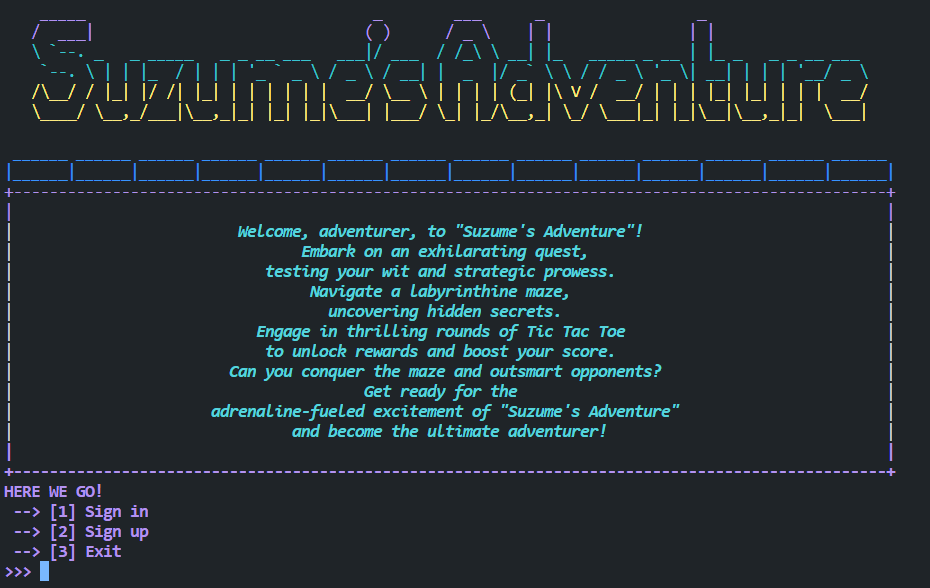

# **7. Constants**

This file package contains 2 items, one of it is a normal Java class, and another one of it is an enum Java class. Both of these files are used to store constants that are repeatedly accessed

<br>

## **GameConstant Java Class**

The given Java class, **GameConstant**, is used to define various constants related to a game, specifically a tic-tac-toe game. These constants provide predefined values for different aspects of the game.

<br>

```java
public class GameConstant {
    public static final int WIN = 1;
    public static final int LOSE = -1;
    public static final int DRAW = 0;

    public static final int PVP = 1;
    public static final int PVE = 2;
    public static final int EVE = 3;

    public static final Rule[] RULES = { Rule.REGULAR, Rule.REVERSE, Rule.VARIANT};

    // Status code
    public static final int EXIT = 404;
    public static final int MOVE = 200;
}
```

**Game Result Constants :**

**WIN** : Represents the constant value 1, indicating a win in the game.

**LOSE** : Represents the constant value -1, indicating a loss in the game.

**DRAW** : Represents the constant value 0, indicating a draw or tie in the game.

**Game Mode Constants :**

**PVP** : Represents the constant value 1, indicating a player versus player mode.

**PVE** : Represents the constant value 2, indicating a player versus engine mode.

**EVE** : Represents the constant value 3, indicating an environment versus engine mode.

**Game Rules Constants :**

**RULES** : Represents an array of Rule objects, where Rule is a custom class representing different rules of the tic-tac-toe game. The array contains Rule.REGULAR, Rule.REVERSE, and Rule.VARIANT, indicating different rule sets for the game.

**Status Code Constants :**

**EXIT** : Represents the constant value 404, indicating an exit status code.

**MOVE** : Represents the constant value 200, indicating a move status code.

<br>

## **MapConstant Java Class**

This Java enum class, **MapConst**, is used to represent constants related to a map in a specific application or scenario. Each constant in the enum represents a different type of element that can exist in the map.

```java
public enum MapConst {
    OBSTACLE(1),
    STATION(2),
    DESTINATION(3);

    public final int VALUE;

    MapConst(int val) {
        this.VALUE = val;
    }

    public boolean is(int val) {
        return this.VALUE == val;
    }
}
```

**Enum Constants :**

OBSTACLE: Represents an obstacle element in the map, typically denoted by the constant value 1.

STATION: Represents a station element in the map, typically denoted by the constant value 2.

DESTINATION: Represents a destination element in the map, typically denoted by the constant value 3.

**Value Field :**

Each enum constant (OBSTACLE, STATION, DESTINATION) has a corresponding VALUE field, which stores the constant value associated with that particular element.

**Constructor :**

The enum class has a constructor that accepts an integer value (val) as a parameter. This constructor is used to initialize the VALUE field of each enum constant with the provided value.

**is() Method :**

The enum class includes an is() method that compares the provided integer value (val) with the VALUE field of the enum constant. If the values match, it returns true; otherwise, it returns false. This method can be used to check if a given value corresponds to a specific enum constant.

## FontStyle

"Finally, we have an amazing set of powerful constants called `FontStyle` that define a range of ANSI color code constants. Now, you might be wondering, what's the fuss about ANSI color? Well, my friend, let me paint you a vivid picture using the following example:

<p align="center">
    
    <br />
    <em>Yep it's boring and unattractive...</em>
</p>

Behold, a simple and humble "Hello World." It's plain, unimpressive, and, dare I say, quite boring. But wait! With a wave of our magic code wand, like so:

```java
System.out.println("\033[0;31mHello World")
```

<p align="center">
    
    <br />
    <em>Now it's look much more attractive!</em>
</p>

Voilà! The colors have changed! Those special codes we just mentioned are none other than the famous ANSI codes. They possess the power to transform the way our supported console displays text—like a makeover for your mundane strings! And let me tell you, it's a remarkable transformation:



Now, isn't our program looking more attractive? It's as if it received a snazzy new outfit to impress its users!

We have defined teh constants as follows:

```java
public class FontStyle {
    // Reset
    public static final String RESET = "\033[0m";  // Text Reset

    // Regular Colors
    public static final String BLACK = "\033[0;30m";   // BLACK
    public static final String RED = "\033[0;31m";     // RED
    public static final String GREEN = "\033[0;32m";   // GREEN
    public static final String YELLOW = "\033[0;33m";  // YELLOW
    public static final String BLUE = "\033[0;34m";    // BLUE
    public static final String PURPLE = "\033[0;35m";  // PURPLE
    public static final String CYAN = "\033[0;36m";    // CYAN
    public static final String WHITE = "\033[0;37m";   // WHITE
    public static final String MAGNETA = "\033[0;35m"; // MAGNETA

    // Omitted code...
}
```
