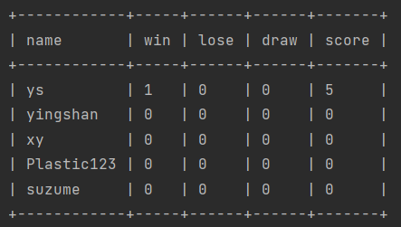

# Database

The Database package contains two classes: `DatabaseConnector.java` and `DatabaseManager.java`. These classes provide functionality for connecting to the database, managing the database connection, and performing database operations.

The Database package serves as the backbone for handling user data and interactions with a database in the application. It facilitates the storage and retrieval of user information, such as usernames, passwords, game statistics (wins, losses, draws, scores), and more.

## Functionality

The package offers the following key functions:

1. **Database Connection**: The `DatabaseConnector` class establishes a connection to the database, allowing other classes to interact with it. It utilizes the JDBC (Java Database Connectivity) API to connect to an SQLite database.


2. **Database Creation**: If the database file does not exist, the `DatabaseConnector` class automatically creates the necessary database table (`users`) during the initialization process. The table structure includes columns for user identification (`id`), username (`name`), password (`password`), game statistics (`win`, `lose`, `draw`, `score`), and more.
    ```java
    private static boolean isDatabaseExists() {
        return new File(databaseFilePath).exists();
    }

    private static void createDatabase() {
        try {
            Class.forName("org.sqlite.JDBC");

            try (Connection connection = DriverManager.getConnection(jdbcURL);
            Statement statement = connection.createStatement()) {

                // Create the table
                final String createTableQuery = "CREATE TABLE users (" +
                        "id INTEGER PRIMARY KEY," +
                        "name TEXT UNIQUE," +
                        "password TEXT," +
                        "win INTEGER," +
                        "lose INTEGER," +
                        "draw INTEGER," +
                        "score INTEGER" +
                        ")";
                statement.executeUpdate(createTableQuery);
            }
        } catch (ClassNotFoundException | SQLException e) {
            e.printStackTrace();
        }
    }
    ```

3. **User Management**: The `DatabaseManager` class handles various user-related operations, such as checking if a user exists, validating passwords, updating game statistics, creating new users, updating passwords, removing users, and loading user data from the database.


4. **Data Visualization**: The `DatabaseManager` class includes a `showDatabase()` method that retrieves all user data from the database and presents it in a formatted table. This feature provides a convenient way to visualize and analyze user statistics, which will also be functioning as the leaderboard of our game system.
    ```java
    public void showDatabase() {
        try (Statement statement = connection.createStatement()) {
            String sql = "SELECT name, win, lose, draw, score FROM users";
            ResultSet rs = statement.executeQuery(sql);

            // Print the table headers
            ResultSetMetaData rsmd = rs.getMetaData();
            int numColumns = rsmd.getColumnCount();
            String[] headers = new String[numColumns];
            for (int i = 1; i <= numColumns; i++) {
                headers[i - 1] = rsmd.getColumnName(i);
            }

            // Create the table object
            PrettyTable table = PrettyTable.fieldNames(headers);

            // Add rows to the table
            while (rs.next()) {
                String[] row = new String[numColumns];
                for (int i = 1; i <= numColumns; i++) {
                    row[i - 1] = rs.getString(i);
                }
                table.addRow((Object[]) row);
            }

            // Print the table
            table.sortTable("score", true);
            System.out.println(table.toString());
        } catch (SQLException e) {
            e.printStackTrace();
        }
    }
    ```

The `com.assignment.suzume.database` package serves as the backbone for handling user data and interactions with a database in the application. It facilitates the storage and retrieval of user information, such as usernames, passwords, game statistics (wins, losses, draws, scores), and more.

## Workflow
The workflow for the Database package involves the following steps:

1. The application initializes the `DatabaseManager` class, which ensures a single instance of the class using the Singleton design pattern. This instance manages the database connection and user-related operations.
    ```java
        private DatabaseManager() {
            this.connection = DatabaseConnector.getConnection();
        }

        public static DatabaseManager getInstance() {
            if (instance == null) {
                instance = new DatabaseManager();
            }
            return instance;
        }
    ```

2. When a user registers or logs in, the `DatabaseManager` class is used to interact with the database. It checks if the user exists, validates passwords, updates game statistics, creates new users, updates passwords, removes users, or loads user data. Below shows one of the methods in the `DatabaseManager` class which checks if the user exists.
    ```java
        public boolean checkIfUserExists(String username) {
            try (PreparedStatement preparedStatement = connection.prepareStatement("SELECT * FROM users WHERE name = ?")) {
                preparedStatement.setString(1, username);

                try (ResultSet resultSet = preparedStatement.executeQuery()) {
                    return resultSet.next();
                }
            } catch (SQLException e) {
                System.out.println("Failed to check user. Error: " + e.getMessage());
                return false;
            }
        }
    ```

3. The `DatabaseManager` class uses prepared statements and SQL queries to interact with the database. Prepared statements provide security against SQL injection attacks and enable parameterized queries.
    ```sql
    SELECT * FROM users WHERE name = ?
    ```
    The SQL statement retrieves all columns from the `users` table where the `name` column matches a specified value (parameterized query).

4. The `showDatabase()` method in the `DatabaseManager` class retrieves user data from the database, constructs a formatted table using the `PrettyTable` library, and displays the table to visualize the user statistics.
    <p>
        
        <br />
        <em>Output of `showDatabase()` method</em>
    </p>

## DatabaseConnector.java

This class handles the connection to the database and the creation of the necessary table.

### Fields

- `databaseFilePath`: A static String variable that holds the path to the database file. The `Configuration.getGameFolderURL()` method is used to get the game folder URL, and the `databaseFilePath` is set accordingly.
- `jdbcURL`: A static String variable that holds the JDBC URL for connecting to the SQLite database. It is constructed by appending the `databaseFilePath` to the `"jdbc:sqlite:"` prefix.
- `connection`: A static Connection variable that represents the database connection.

### Methods

- `isDatabaseExists()`: A private static method that checks if the database file exists. It uses the `File` class to check if the file at `databaseFilePath` exists.
- `createDatabase()`: A private static method that creates the database table if it doesn't exist. It uses JDBC to execute a CREATE TABLE query on the `users` table.
- `getConnection()`: A public static method that returns the database connection. If the connection is null, it creates a new connection and initializes the database if necessary. It uses the `DriverManager.getConnection()` method to establish a connection to the database.
- `closeConnection()`: A public static method that closes the database connection. It simply calls the `close()` method on the `connection` object if it is not null.

## DatabaseManager.java

This class provides methods for managing user data in the database, such as checking if a user exists, updating user game status, creating a new user, and more.

### Fields

- `instance`: A private static variable that holds the singleton instance of the `DatabaseManager` class. It ensures that only one instance of `DatabaseManager` is created.
- `connection`: An instance variable of type `Connection` that represents the database connection.

### Constructor

- `DatabaseManager()`: A private constructor that initializes the `connection` field with the database connection obtained from the `DatabaseConnector`. It is only called once to create the singleton instance.

### Methods

- `getInstance()`: A public static method that returns the singleton instance of the `DatabaseManager` class. If the instance is null, it creates a new instance using the private constructor.
- `checkIfUserExists(String username)`: Checks if a user with the specified username exists in the database. It uses a prepared statement to execute a SELECT query on the `users` table and checks if any rows are returned.
- `checkIfPasswordMatch(String username, String password)`: Checks if the password matches the stored password for the given username. It retrieves the stored password from the database using a prepared statement and compares it with the hashed password using the `PasswordEncoder.hashPassword()` method.
- `updateUserGameStatus(User user)`: Updates the game status (win, lose, draw, score) for the specified user in the database. It uses a prepared statement with an UPDATE query to update the corresponding fields in the `users` table.
- `createNewUser(String username, String password)`: Creates a new user with the specified username and password in the database. It uses a prepared statement with an INSERT query to insert a new row into the `users` table.
- `updateUserPassword(String username, String newPassword)`: Updates the password for the specified user in the database. It uses a prepared statement with an UPDATE query to update the `password` field in the `users` table.
- `removeUser(String username)`: Removes the user with the specified username from the database. It uses a prepared statement with a DELETE query to remove the corresponding row from the `users` table.
- `loadUser(String username)`: Loads the user with the specified username from the database and initializes the user profile. It uses a prepared statement with a SELECT query to retrieve the user data from the `users` table and initializes the `User` profile object.
- `showDatabase()`: Retrieves all user data from the database and displays it in a formatted table. It uses a statement to execute a SELECT query on the `users` table, retrieves the result set, and uses the `PrettyTable` library to create and print a formatted table.

Overall, the Database package acts as a bridge between the application and the underlying database, providing essential functionality to store, retrieve, and manage user data effectively.